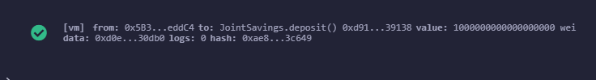
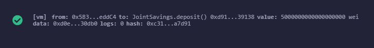
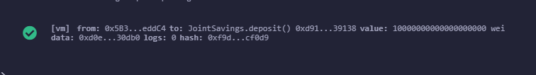
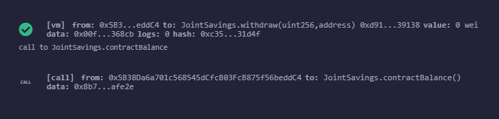
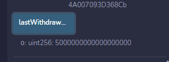

# Week 20 Assessment Task

# Background

A fintech startup company has recently hired you. This company is disrupting the finance industry with its own cross-border, Ethereum-compatible blockchain that connects financial institutions. Currently, the team is building smart contracts to automate many of the institutions’ financial processes and features, such as hosting joint savings accounts.
To automate the creation of joint savings accounts, you’ll create a Solidity smart contract that accepts two user addresses. These addresses will be able to control a joint savings account. Your smart contract will use ether management functions to implement a financial institution’s requirements for providing the features of the joint savings account. These features will consist of the ability to deposit and withdraw funds from the account.

## What You're Creating

The completed Solidity JointSavings smart contract.

A folder named Execution_Results that contains at least eight images. These images should confirm that the deposit and withdrawal transactions, which are designed to test the JointSavings functionality in the JavaScript VM, worked as expected.

## Instructions
The steps for this homework are divided into the following sections:

 * Create a Joint Savings Account Contract in Solidity
 * Compile and Deploy Your Contract in the JavaScript VM
 * Interact with Your Deployed Smart Contract

---

## Results

### Deposit 1 Ether in Wei

### Deposit 5 Ether in Wei

### Deposit 10 Ether in Wei

### Withdrawal
The following shows a 5 Ether withdrawal with confirmation.

